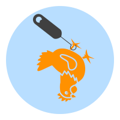

# ChickenHook 

## General

Supported platforms: x86, arm64

## Usage
1. Global variable (will be replaced with singelton in future)

    
    static ChickenHook chickenHook;
    

2. Init chickenhook (only once!)

    
    
    chickenHook.init();
    

3. Create the hook function (the function that should be called instead of the original function)

example here shows a hook function for libc's open

    int my_open(const char *__path, int __flags, ...) {
        __android_log_print(ANDROID_LOG_DEBUG, "stringFromJNI", "open called [-] %s", __path);

        int res = -1;
        Trampoline trampoline;
        if (chickenHook.getTrampolineByAddr((void *) &open, trampoline)) {
            __android_log_print(ANDROID_LOG_DEBUG, "stringFromJNI",
                            "hooked function call original function");

            trampoline.copyOriginal();
            res = open(__path, __flags);
            trampoline.install();
            return res;
        } else {
            __android_log_print(ANDROID_LOG_DEBUG, "stringFromJNI",
                            "hooked function cannot call original function");
        }
        return -1;
    }

4. Inject the trampoline  (enable the hook)

    
    chickenHook.inject((void *) &open, (void *) &my_open);
    

## Build

